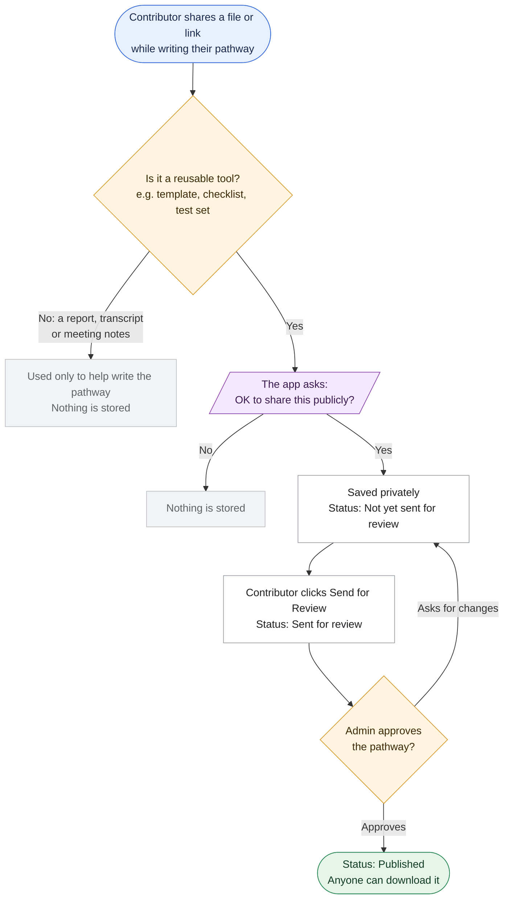
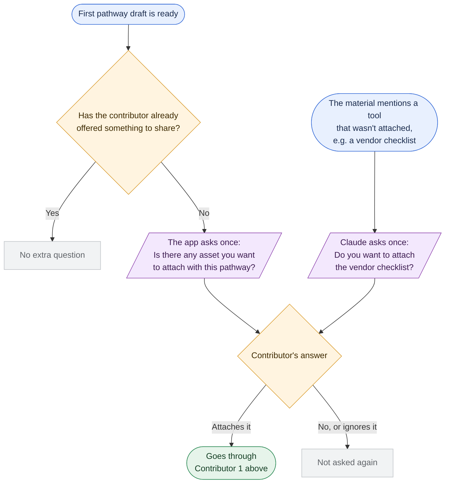
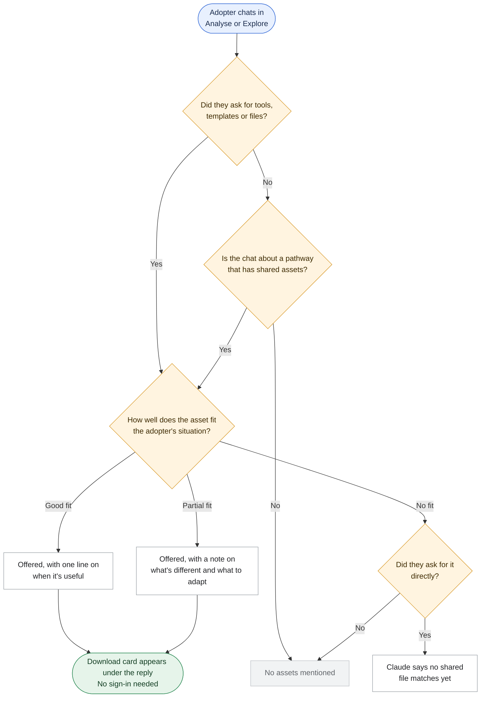
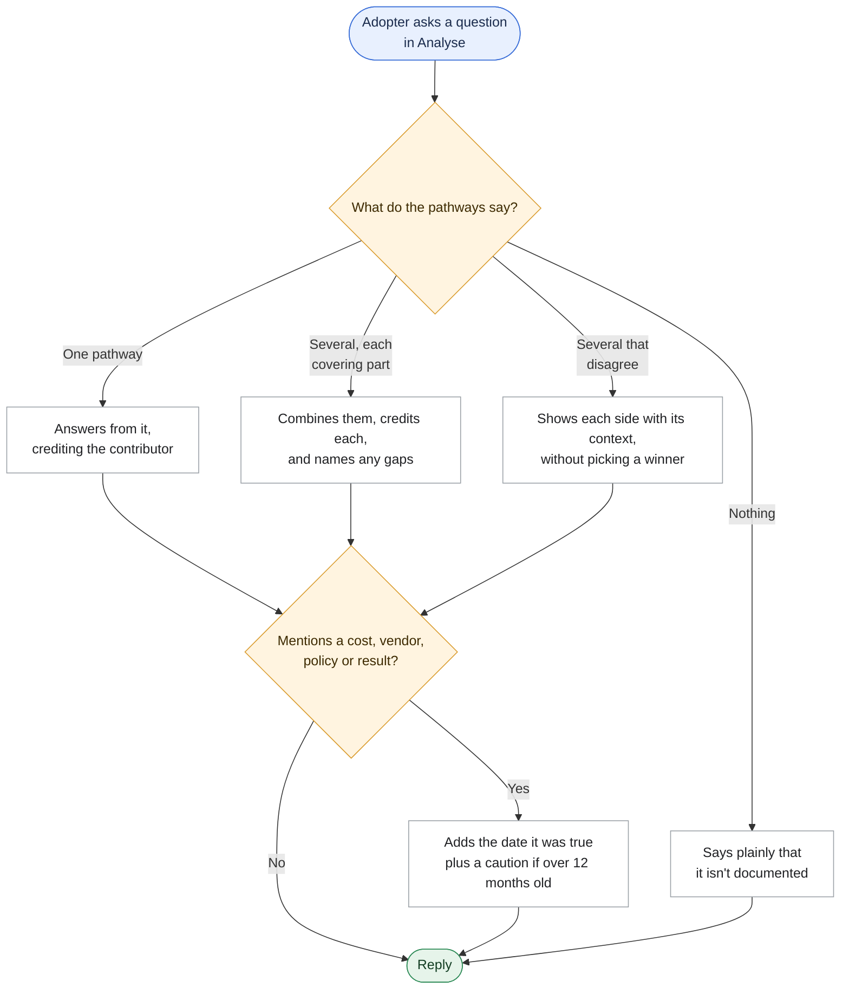

# Plan: Store Toolkit Asset Files and Surface Them in `/analyse` and `/explore`

> Status: **Approved 2026-09-30** (Stage 3 of `brd-task-creator`), with N1–N3 answered. This supersedes both earlier versions. **Extended 2026-10-05** with the behaviour specification (appendix): the contributor ask for assets, adopter match levels, evidence handling and dates, built with decisions D1–D7 (B10.5). Decision history is in [`clarifications.md`](clarifications.md); build tasks are in [`task-list.md`](task-list.md).

## Summary

Contributors can attach real toolkit asset files (PDF, Word, PowerPoint, Excel, CSV/TXT/MD, images) or https links inside their `/contribute` workspace. The contributor companion flags uploads that genuinely look like reusable assets, and the contributor answers one explicit question: **"OK to share this publicly?"** Yes stores the file privately in Supabase Storage and records it in `contribution_units`. No stores nothing.

Assets are **reviewed and published with their pathway**:
- **Send for Review** (assemble) writes a generated "Toolkit asset files" block into the pathway document, so the admin reviews the assets as part of the pathway.
- **Admin publish** publishes exactly the assets listed in that reviewed document.

Published assets are **public**: anyone can view and download them, signed in or not. **Claude surfaces them in conversation** in both places:
- **`/analyse`:** the companion returns asset IDs in `<grid_update>` and the client renders download cards.
- **`/explore`:** after some exchanges in a pathway's chat, Claude says "these are the assets associated with this pathway". Its reply carries a trailing asset-ID tag that the client renders as download cards.

**Behaviour additions (2026-10-05, see the appendix):**
- **Contributors are asked.** Under the first draft, if nothing has been offered for sharing yet, the app asks once: *"Is there any asset you want to attach with this pathway?"* Claude also asks once about any specific artifact the material names but didn't attach.
- **Adopters get match-aware offers.** Each asset is judged on its own as a full, partial or no match. A partial match is offered with a plain caveat; no match means silence, unless the user asked outright, in which case Claude says nothing matches.
- **Evidence handling in `/analyse`:** evidence spread across pathways is combined with attribution; missing evidence is stated plainly; conflicting experiences are shown side by side with their conditions; dated facts carry their as-of date and a caution past 12 months.

## Scope

**In scope**
- Contributor-only attach: pdf, doc, docx, ppt, pptx, xls, xlsx, csv, txt, md, png, jpg/jpeg, gif, webp, up to 25 MB; plus https links. **No ZIP.**
- AI identification plus a single explicit **public-sharing** consent question
- Private Supabase Storage bucket, created in the migration, with Supabase-enforced size and MIME limits
- Asset records in `contribution_units` (`unit_type='toolkit-asset'`)
- Generated asset block in the pathway document at assemble time (GitHub `.md`, `content_cache`, then `published_pathways` on admin publish)
- Publish-with-pathway, bound to the asset IDs in the reviewed document
- Admin pathway card lists the pathway's assets with preview links
- **Conversational** surfacing in `/analyse` (companion) and `/explore` (library pathway chat), as validated download cards
- **Public** download and metadata for published assets
- Storage cleanup when a pathway or an account is deleted
- `content/framework.md` rows for Playbook and Toolkit Asset (a dependency for AI identification)
- Fixes for security findings in code this feature touches: #2 (library `pathwayId` traversal), #4 (slug → GitHub path), #6 (assemble `designId` ownership)
- *(2026-10-05)* The contributor ask for assets: one general question from the app, plus targeted questions from Claude (B3)
- *(2026-10-05)* Adopter full / partial / no-match framing for assets, and the explicit-ask rules (B7)
- *(2026-10-05)* Evidence handling in `/analyse` (scattered, missing, conflicting, stale) and the dates rule in `/explore` (B9)
- *(2026-10-05)* Dates for pathways in the prompt corpus, and a shared date for assets in the prompt and on the download card

**Out of scope**
- ZIP, licence field, admin uploads, backfill of the 36 corpus-described assets
- Per-asset approve/reject/exclude at publish (N3), revoke/unpublish
- A fixed UI asset list (N2 chose conversation-only), the Analysis Document, `/wiki` pages
- Assets on the library **overview** chat (no specific pathway) or on static curated pathways (no `pathways` row)
- Rate limiting of downloads (flagged as a risk; see security finding #3)
- Enhancements (see the Future Upgrade Roadmap)

## Assumptions

- **A1.** The file is uploaded only after the contributor answers Yes. Until then it's held in browser memory; a reload means re-attaching.
- **A2.** An asset belongs to a `pathways` row, not a unit number.
- **A3.** Contributors see each asset as **Awaiting pathway review** or **Published**.
- **A4 (N1).** Published assets are public: the download and metadata routes need no session. Unpublished assets can be previewed only by their uploader and by admins.
- **A5 (N2).** "After some chats" in `/explore` means: **never on the kickoff overview turn**; at the earliest on the visitor's second message, or immediately when the visitor asks about tools, templates, resources, files, or how to reuse or implement the pathway. Assets are mentioned when relevant, without being repeated every turn. *(2026-10-05, D1)* In `/analyse`, an explicit ask in the user's very first message overrides the first-reply ban. The `/explore` kickoff has no user message, so it's unaffected.
- **A6 (N3).** Publishing publishes every asset listed in the reviewed document. Assets attached after the last Send for Review go out on the next assemble plus publish.
- **A7.** Files are stored in the private bucket at consent time (so the admin can preview them) and are served only through the app's download route, via 60 s signed URLs, once published.
- **A8 (2026-10-05, D2).** The general "Is there any asset you want to attach with this pathway?" question is added by the app under the first draft, not written by Claude. The contributor prompt's step rules leave Claude no clean turn for it.
- **A9 (D3, D4).** Assets from an adjacent pathway count, at best, as partial matches. When an explicit ask finds no asset, Claude may point to a toolkit a pathway only describes in text, labelled as having no file.
- **A10 (D5, D7).** Staleness threshold is 12 months; time-sensitive facts (cost, vendor or model, policy, measured results) always carry their date. A community pathway with no `timestamp` uses its first publish date, labelled "First published".

## Affected Areas

| Area | Component(s) | Nature of change |
|---|---|---|
| Data | `supabase/migrations/0034_contribution_units_toolkit_assets.sql` (new) | Add asset columns and constraints to `contribution_units`; drop the client insert/update policies; create the private `toolkit-assets` bucket (25 MB limit, MIME allow-list) with **no** client storage policies |
| Domain logic | `lib/toolkit-assets.ts` (new) | Types, allowed extensions/MIME, path builder, `renderToolkitAssetBlock` / `applyToolkitAssetBlock`, `assetIdsInDocument`, `loadPublishedToolkitAssets({ pathwaySlug? })`, `parseToolkitAssetsTag` / `stripToolkitAssetsTag` (library replies), signed upload/download helpers (service role) |
| Domain logic | `lib/grid-update.ts` | Contributor `toolkitAssetCandidates`; explorer `toolkitAssetsReferenced` |
| Domain logic | `lib/system-prompts.ts` | `contributorSystemPrompt`: identification section; `gridUpdateContract` options; `explorerSystemPrompt`: published-assets block + surfacing rule; **`libraryPathwaySystemPrompt(document, assets)`**: the pathway's assets + timing rule + trailing-tag contract; `pathwayDraftSystemPrompt`: omit the asset block |
| Framework content | `content/framework.md` | Playbook and Toolkit Asset rows |
| Client logic | `lib/adoption-conversation.ts`, `lib/extract-text.ts` | Asset-eligible `File` retention (contributor flow); `.doc`/`.ppt` and images over 5 MB accepted as asset-only; candidates → consent card → signed upload → register; persist `toolkitAssetsReferenced` on explorer messages |
| Client logic | `app/explore/ExploreLibrary.tsx` | Strip the `<toolkit_assets>` tag from streamed library replies (never shown half-streamed), validate the IDs, render cards, persist validated IDs on the message (saved to `library_conversations` for signed-in users) |
| Routes/API | `app/api/toolkit-assets/upload-url/route.ts` (new) | `pathway_contributor` + membership + type/size → `createSignedUploadUrl` |
| Routes/API | `app/api/toolkit-assets/route.ts` (new) | POST (contributor): register a consented asset. GET `?ids=` (**public**): published-asset card metadata |
| Routes/API | `app/api/toolkit-assets/[id]/download/route.ts` (new) | **Public** for published assets → 302 to a 60 s signed URL or to `link_url`; unpublished → uploader or admin session only |
| Routes/API | `proxy.ts` | Add `/api/toolkit-assets` to `PUBLIC_PATHS`. The handlers enforce auth for the contributor POST routes, which is the repo's rule that the API route is the real gate |
| Routes/API | `app/api/pathways/assemble/route.ts` | Apply the asset block before commit/cache; validate the slug (#4); verify `designId` ownership and pathway link (#6) |
| Routes/API | `app/api/admin/pathways/publish/route.ts` | After the upsert, publish the pathway's assets whose IDs appear in the published content |
| Routes/API | `app/api/chat/route.ts` | Explorer companion: pass published assets. Library mode: validate `pathwayId` (#2); when it resolves to a DB pathway, pass that pathway's published assets to `libraryPathwaySystemPrompt` |
| Routes/API | `app/api/admin/pathways/delete/route.ts`, `app/api/account/delete/route.ts` | Remove storage objects before rows cascade / are deleted (account delete: unpublished assets only) |
| Frontend | `components/ToolkitAssetConsentCard.tsx` (new), `components/ChatPanel.tsx` | Single public-sharing consent card |
| Frontend | `components/PathwayDocumentPane.tsx` | Contributor asset status list |
| Frontend | `components/AdminPathwayRowCard.tsx`, `app/admin/page.tsx` | The pathway's assets (from `content_cache` markers), with preview links and a "not scanned" label |
| Frontend | `components/ToolkitAssetCard.tsx` (new) | Shared download card used by `ChatPanel` (`/analyse`) and `ExploreLibrary` (`/explore`) |
| Client logic *(2026-10-05)* | `lib/adoption-conversation.ts` `appendPathwayDocMessage` | General asset question under the first draft when no consent card exists (B10.1) |
| Domain logic *(2026-10-05)* | `lib/system-prompts.ts` | Contributor targeted-ask bullet; `evidenceHandlingRules()` in the explorer prompt; length exception; adjacent pathways in `/analyse` `whereRelevant`; dates paragraph in the library prompt (B10.1–B10.3) |
| Domain logic *(2026-10-05)* | `lib/toolkit-assets.ts` | `toolkitAssetTimingRules` match levels and explicit-ask rules; `formatAssetMonth`; `publishedAt` on summaries and prompt lines (B10.2, B10.4) |
| Data access *(2026-10-05)* | `lib/wiki-loader.ts`, `app/api/chat/route.ts`, `lib/toolkit-assets-server.ts`, `components/ToolkitAssetCards.tsx` | `datedLine()` beside "Contributed by"; the same for the `/explore` DB fallback; `publishedAt` through to the card (B10.4) |

## Architectural Approach

**1. Where it lives.** Everything sits inside the existing Contributor → assemble → admin publish pipeline. Assets ride the same two-step gate as the pathway document, and the only new platform piece is Supabase Storage (same vendor, same service-role client). Surfacing reuses the one pattern the app already has for "the model mentions it, the client renders it" (`pathwaysReferenced`), in both chats.

**2. The model signals, the client acts.**
- **Contributor:** the companion adds `toolkitAssetCandidates` to `<grid_update>`. The client shows a card: **"OK to share this publicly? Anyone using 100 Pathways, including visitors who aren't signed in, will be able to download it."** Yes / No. Yes means upload and register, storing `share_consent` and `share_consented_at`; No means nothing is stored.
- **`/analyse`:** the companion adds `toolkitAssetsReferenced: [id]`. The client validates the IDs via public `GET /api/toolkit-assets?ids=`, renders cards, and persists the IDs.
- **`/explore`:** `libraryPathwaySystemPrompt` receives that pathway's published assets and the A5 timing rule. When it mentions them ("these are the assets associated with this pathway"), the reply ends with `<toolkit_assets>["asset-…"]</toolkit_assets>`. `ExploreLibrary` hides the tag from the moment it starts streaming, then keeps only IDs that are published **and** belong to the open pathway, and renders cards. The model never writes a URL in either chat.

**3. Identification needs the definition present.** `framework.md`'s unit-type table (`:294-300`) lacks Playbook and Toolkit Asset, and it is the file the contributor prompt injects.

**4. Upload path.**
1. `upload-url` checks role, membership, extension and size, then calls `createSignedUploadUrl('<pathwayId>/<uuid>/<safe-name>')` with the service role.
2. The browser calls `uploadToSignedUrl` directly (avoiding the ~4.5 MB Vercel body limit). The bucket's `file_size_limit` and `allowed_mime_types` enforce limits at Supabase.
3. Register checks that the object exists under that pathway's prefix, then inserts the row (service role).

There are no client storage policies. Every read goes through the download route.

**5. Records.** One `contribution_units` row per asset:
- `section='micro-innovation'`, `unit_type='toolkit-asset'`
- `unit_internal_id='asset-<uuid>'`
- `published_at` is null until its pathway is published

**6. Publish-with-pathway, bound to what was reviewed.**
- **Assemble:** applies the block (`<!-- toolkit-assets:start/end -->`, one `<!-- asset-id: … -->` entry per consented asset with name, kind, purpose and reuse condition, no URL) at the end of Section 4 (falling back to before Source Trace), then writes GitHub and `content_cache`.
- **Admin publish:** after the upsert, sets `published_at = now()` for this pathway's unpublished assets whose IDs are in `assetIdsInDocument(content_cache)`.
- The draft prompt omits the block and assemble regenerates it, so the model can neither drop nor forge entries.

**7. Public access (N1).** The download route serves published assets without a session. It mints a fresh 60 s signed URL per request and redirects, so there is no permanent public object URL, and the bucket stays private. Asset IDs are already visible in the public `published_pathways.content` markers, which is acceptable because the assets are public by consent.

## Alternatives Considered

| Alternative | Why rejected |
|---|---|
| Public-read bucket (direct object URLs) | Simpler, but gives permanent URLs that stay live after a pathway or account is deleted and until the object is removed. It also exposes unpublished files if a path leaks. Route-minted signed URLs keep a single check (published or not) in app code. |
| Fixed "Toolkit assets" UI list in `/explore` | Rejected by the requester (N2: conversational only). |
| Add a `<grid_update>` contract to library chat | Heavier than needed: library chat has no grid. A single-purpose trailing tag is minimal and mirrors `<deliverable>` / `<grid_update>` handling. |
| Per-asset admin approval | Reversed by the requester (assets ride the pathway gate). |
| Publish all of the pathway's unpublished assets on publish | Would publish assets the admin never saw (TOCTOU). Binding to the reviewed document's IDs avoids this. |
| AWS S3 | Replaced by Supabase Storage. |
| Keep "all adopters" consent wording | Inaccurate once downloads are public (N1). Informed consent needs the public wording. |

## Key Tradeoffs

**Tradeoff: public assets (N1)**
- Gained: frictionless reuse and discovery for anyone.
- Given up: contributor files are downloadable by the whole internet. Egress costs can be abused because there is no rate limit (security finding #3), and scraping is possible. Consent wording must say "public", and the Terms need checking.

**Tradeoff: conversational-only surfacing (N2)**
- Gained: assets appear in context, only when relevant.
- Given up: discovery depends on the model following the timing rule. A visitor who never chats past the kickoff won't see assets. No new AI call is added, but the library prompt grows by the pathway's asset list.

**Tradeoff: assets ride the pathway gate (N3)**
- Gained: one review step, and assets always match a reviewed document.
- Given up: no per-asset reject. Late-added assets wait for the next round.

**Tradeoff: consent-then-upload with in-memory retention**
- Gained: nothing stored without consent.
- Given up: a reload before answering loses the file.

## Non-Functional Impact

- **Performance/scale:**
  - One indexed query per explorer companion turn and per library pathway turn.
  - One small `?ids=` call per reply that references assets.
  - Roughly 50 prompt tokens per asset: across all published assets in explorer turns, but only the open pathway's in library turns.
  - File bytes never pass through the app.
- **Availability/failure modes:**
  - Storage errors surface as handled errors on upload or download; chats keep working.
  - Upload succeeds but register fails: the orphan object is tolerated.
  - Publish succeeds but asset flagging fails: re-publishing is idempotent and retries.
  - A malformed or missing `<toolkit_assets>` tag means no cards and no crash.
  - No new Anthropic call is introduced (TD-05 unchanged).
- **Security:**
  - Private bucket with no client policies. Paths are server-built with sanitised names, and Supabase enforces size and MIME limits. Links must be https.
  - Unpublished assets are readable only by the uploader or an admin.
  - `contribution_units` client write policies are dropped (#8 for this table).
  - Security findings #2, #4 and #6 are fixed in the code this work touches.
  - **Public downloads have no rate limit, and there is no malware or PII scan.** Both are flagged below.
- **Consistency/coupling:** `ToolkitAssetCard` and `lib/toolkit-assets.ts` are shared across both chats. Library chat gains a dependency on `contribution_units`.

## Data Model / API Changes

**Migration `0034_contribution_units_toolkit_assets.sql`** (additive except the policy drop, and the header says so):
- New columns: `asset_kind` (file|link), `asset_name`, `purpose`, `reuse_condition`, `storage_path`, `file_name`, `mime_type`, `size_bytes`, `link_url`, `share_consent` (default false), `share_consented_at`.
- Toolkit-asset checks: `asset_kind` required; file ⇒ `storage_path`; link ⇒ `link_url`; `share_consent = true`.
- Partial index `(pathway_id, published_at) where unit_type = 'toolkit-asset'`.
- Drop the two client write policies.
- `insert into storage.buckets (..., public = false, file_size_limit = 26214400, allowed_mime_types = […])`, with no `storage.objects` policies.

**Routes**

| Method | Path | Auth | Request → Response |
|---|---|---|---|
| POST | `/api/toolkit-assets/upload-url` | `pathway_contributor` + membership | `{pathwayId, fileName, size, mimeType}` → `{path, token}` |
| POST | `/api/toolkit-assets` | `pathway_contributor` + membership | `{pathwayId, designId, kind, storagePath?, linkUrl?, fileName?, name, purpose, reuseCondition, dimension?, stage?, shareConsent: true}` → `{id, status:'awaiting_pathway_review'}` |
| GET | `/api/toolkit-assets?ids=` | **public** | Published assets only: `[{id, name, purpose, kind, fileName?, sizeBytes?, linkDomain?, pathwaySlug, pathwayTitle, publishedAt}]`; max 20 (`publishedAt` added 2026-10-05) |
| GET | `/api/toolkit-assets/[id]/download` | **public** if published; uploader/admin otherwise | 302 → 60 s signed URL or `link_url`; 404 otherwise |

Changed: `POST /api/pathways/assemble`, `POST /api/admin/pathways/publish`, `POST /api/chat` (library: `pathwayId` validation and assets in prompt), `proxy.ts` `PUBLIC_PATHS`.

**Model contracts:**
- contributor `<grid_update>`: `toolkitAssetCandidates[]`
- explorer `<grid_update>`: `toolkitAssetsReferenced[]`
- library reply: optional trailing `<toolkit_assets>[ids]</toolkit_assets>`

## Risks & Open Items

1. **Public downloads with no rate limit:** egress-cost abuse and scraping. Recommend reusing whatever limiter is built for security finding #3; not in this scope unless requested.
2. **Consent and legal:** public sharing of contributor files should be checked against `content/legal/terms.md` (the contributor content licence) before launch. The consent wording in §2 is a proposal for that review.
3. **No malware or PII screening.** Files become public on pathway approval. The admin card labels them "not scanned", and the admin preview is the only check.
4. **Conversational-only discovery (N2)** depends on the model following the timing rule. Verify during testing; a fixed list stays on the roadmap as a fallback.
5. **Late-added assets** wait for the next round (A6). The contributor status list must make that clear.
6. **Static curated pathways can't carry assets.** The MahaVISTAAR example needs a DB pathway (slug collision with the static file is pre-existing and flagged).
7. **TD-16:** the Anthropic account expires 28-Oct-2026. Identification and both chats' surfacing depend on it; upload, publish and download do not. No hard date.
8. **Wiki refresh** after landing.
9. *(2026-10-05)* **The behaviour additions are prompt-driven.** Match levels, targeted asks and evidence handling depend on the model following them; only the general asset question and the dates are deterministic. They need the live test pass listed in B10.6.
10. *(2026-10-05)* **Longer `/analyse` replies.** Combining or contrasting pathways allows a lead-in plus up to four bullets. Watch for this exception being used too often.

## Sequencing

1. **S1** Migration `0034` + `lib/toolkit-assets.ts`
2. **S2** `framework.md` rows + contributor identification + `toolkitAssetCandidates`
3. **S3** Contributor client: retention, asset-only types, consent card, upload-url + register, status list
4. **S4** Assemble (block + #4/#6) and admin publish (asset publishing) + admin card list + draft-prompt instruction
5. **S5** Public download route + public `GET ?ids=` + `proxy.ts`
6. **S6** `/analyse` surfacing
7. **S7** `/explore` surfacing (library prompt + tag + cards) + `pathwayId` validation (#2)
8. **S8** Storage cleanup on deletes
9. **S9** *(2026-10-05)* Contributor ask for assets: general question + targeted ask (B10.1)
10. **S10** *(2026-10-05)* Adopter match levels and explicit-ask rules (B10.2)
11. **S11** *(2026-10-05)* Evidence handling and dates (B10.3, B10.4)

## Future Upgrade Roadmap (documentation only)

1. Structured metadata aligned to the company-brain toolkit schema
2. Toolkit Catalogue page, or a fixed per-pathway asset list (fallback for N2)
3. "Adapt this for me" AI mode
4. Reuse signals: download counts and "this helped" feedback (the Incentivize / Usage & Reuse milestones). The public download route is where to count.
5. Versioning, supersession, revoke/unpublish, per-asset exclusion at publish
6. Gap-matched suggestions and an Analysis Document section
7. Upload safety (malware, PII) and download rate limiting
8. ZIP support; backfill of the corpus-described assets; assets for static curated pathways

---

## Appendix: Behaviour Specification (added 2026-10-05)

The complete scenario-by-scenario behaviour of toolkit assets in both flows, plus how the adopter companion handles scattered, missing, conflicting and stale evidence (B9). The plain-language rules are in [`requirement.md`](requirement.md) → "How the assistant behaves"; the build log is in [`../../../specs/TOOLKIT_ASSETS_SPEC.md`](../../../specs/TOOLKIT_ASSETS_SPEC.md).

Every scenario has an ID (`C-xx` contributor, `A-xx` adopter) so QA can reference it. Each one gives the trigger, the expected behaviour, and a status:

| Status | Meaning |
|---|---|
| ✅ Implemented | The code or prompt already does this. A reference shows where. |
| ⚠️ Partial | Some of it is in place, but the behaviour is ambiguous or incomplete. The target is stated. |
| ❌ Gap / out of scope | Not built. Either deliberately out of scope, or the target is stated for later. |
| 🟢 Built, not live-tested | Implemented on 2026-10-05 (B10) with the default decisions (D1–D7). Type-check and build pass; model behaviour still needs the live test pass (B10.6). |

"Claude" means the contributor companion (`/contribute`), the explorer companion (`/analyse`), or the library chat (`/explore`), whichever the section is about.

### B1. Key concepts

#### B1.1 Four things that look alike but aren't

| Thing | What it is | Where it lives | Downloadable? |
|---|---|---|---|
| **Toolkit asset (file or link)** | The actual reusable artifact a contributor attached and agreed to share publicly | One `contribution_units` row (`unit_type='toolkit-asset'`); the file sits in the private `toolkit-assets` bucket | Yes, once its pathway is published |
| **Described toolkit unit** | A Section 3 "Toolkit Asset" unit, or a row in Section 4 "Toolkits and playbooks" of a pathway document: **text only** | Pathway `.md` (committed corpus or `published_pathways`) | No. Claude can talk about it, but no card appears |
| **Source material** | Documents that *describe* the deployment: transcripts, reports, write-ups, notes, narrative decks | Text-extracted in the browser, then discarded | Never stored |
| **External resource** | Curated tools and repos in `content/resources.md` | Explorer prompt only | Rendered as an inline markdown link, not a card. Unrelated to this feature |

The curated corpus pathways (MahaVISTAAR, Blue Dots and the others) have **described toolkit units only, no files**. Backfilling them is out of scope ([`requirement.md`](requirement.md)).

#### B1.2 The qualification bar

From [`content/framework.md:302`](../../../content/framework.md#L302):

> **Toolkit Asset:** an actual reusable artifact (a checklist, template, schema, test set, glossary, or built tool) that someone else can lift and adapt without rebuilding it. A decision about how to structure something is a Decision, not a Toolkit Asset.

The test Claude applies: **could another team take this file or link as-is and use it, without first reading the story of this deployment?** If yes, it's an asset. If it only makes sense as an account of what happened, it's source material.

#### B1.3 Lifecycle of one asset

The journey of a single asset, from the contributor's upload to an adopter's download.

#### B1.4 Flow charts

Four simple workflows, two for contributors and two for adopters, written from the user's point of view. They show the main path only; the edge cases and scenario IDs are in the tables in B2–B9.

**Colour key:** blue = where it starts · yellow = a decision · purple = a question the user sees · white = a step · green = good outcome · grey = nothing happens

##### Contributor 1: sharing a file or link

Good to know:
- Files can be up to 25 MB. ZIP files aren't supported, and links must start with `https://`.
- Each file is asked about only once. Saying No means the app won't ask about it again.
- An asset added after Send for Review goes live with the pathway's next approval.

##### Contributor 2: when the app asks for assets

Good to know:
- These questions never block publishing. A contributor can send the pathway for review without attaching anything.
- Claude only asks about tools the material actually mentions. It never suggests ones that aren't there.

##### Adopter 1: when an asset is offered

Good to know:
- Assets never appear in Claude's first reply, unless the adopter asks for them straight away.
- Each asset is offered once per chat, and again only if the adopter asks.
- **Analyse** can offer any published asset. A pathway chat in **Explore** offers only that pathway's assets, and the Explore overview offers none.
- An asset shared more than 12 months ago shows when it was shared.

##### Adopter 2: how Analyse uses the evidence

Good to know:
- Anything Claude infers rather than reads in a pathway is labelled as its own read.

---

### B2. Contributor: which uploads are toolkit assets

**Principle:** most of what a contributor uploads is source material. A file becomes a candidate only if it passes the bar in B1.2. Being a PDF, being long, or being well organised never qualifies a file on its own.

Rules live in [`lib/system-prompts.ts:447-456`](../../../lib/system-prompts.ts#L447-L456).

#### B2.1 Classification by content

| ID | Contributor shares… | Asset? | Expected behaviour | Status |
|---|---|---|---|---|
| C-01 | A launch **checklist** PDF | ✅ Yes | A consent card appears under Claude's reply. Claude's prose doesn't mention it. | ✅ Implemented (live test A2) |
| C-02 | An **interview transcript** (PDF/DOCX) | ❌ No | Used as source material for the pathway. No card. | ✅ Implemented (live test A4) |
| C-03 | A **project report, case study, narrative write-up, meeting notes** | ❌ No | Source material. No card, however long or polished. | ✅ Implemented |
| C-04 | A **deck that describes the deployment** (pitch, steering-committee update, results summary) | ❌ No | Source material. | ✅ Implemented |
| C-05 | A **deck that is itself reusable**, e.g. a training deck for field staff that another team could run as-is | ✅ Yes | Card. The test is reuse, not file type. | ✅ Implemented (prompt bar); ⚠️ depends on model judgement, so include it in the live pass |
| C-06 | A **design-decision document** ("why we chose a gateway architecture") | ❌ No | A decision, however carefully documented. It feeds Section 3 as a Decision unit. | ✅ Implemented |
| C-07 | A **template** (DOCX/XLSX), **cost model**, **schema**, **glossary**, **prompt library** | ✅ Yes | Card. | ✅ Implemented |
| C-08 | A **test set / QA matrix** as CSV | ✅ Yes | CSV is read as text in the contributor flow, so Claude sees the actual rows. Card. | ✅ Implemented (fixed after live test A6) |
| C-09 | A file Claude can't read: `.doc`, `.ppt`, a scanned PDF with no text layer, an image over 5 MB | Depends | Arrives as "Uploaded asset file: … its contents can't be read here". Claude judges from the **file name and what the contributor says**. If either points to a template, checklist, test set, schema, glossary, cost model or tool → card. Claude doesn't question the contributor about the contents. Only if nothing at all says what the file is does Claude ask **one** short, neutral question. | ✅ Implemented |
| C-10 | A **mixed document**: a narrative report with a checklist embedded in an appendix | ❌ No (the document) | The document is source material, so no card for it. Claude notices the embedded artifact and asks once whether they want to attach a standalone version (see C-21). | 🟢 Built 2026-10-05, not live-tested (classification + targeted ask) |

#### B2.2 Links

| ID | Contributor pastes… | Asset? | Expected behaviour | Status |
|---|---|---|---|---|
| C-11 | Their **own repo or tool** (https) that the deployment built | ✅ Yes | Card showing the link's domain. | ✅ Implemented |
| C-12 | A **third-party / open-source** repo or platform **the deployment actually built on or adapted** | ✅ Yes | Card. Precedent: MahaVISTAAR lists OpenAgriNet and Voicera as Toolkit Assets. | ✅ Implemented (owner decision 2026-09-30) |
| C-13 | A tool **only mentioned in passing, or evaluated and not used** | ❌ No | No card. | ✅ Implemented |
| C-14 | An **http://** link | ❌ No | Never a candidate. The parser drops it as well. | ✅ Implemented |
| C-15 | Claude "corrects" or constructs a URL the contributor never typed | ❌ Blocked | The client shows a card only for a link that appears **verbatim** in the contributor's own messages. A constructed URL produces no card. | ✅ Implemented ([`lib/adoption-conversation.ts:673-687`](../../../lib/adoption-conversation.ts#L673-L687)), after live test round 5 |

#### B2.3 Conversation dynamics

| ID | Situation | Expected behaviour | Status |
|---|---|---|---|
| C-16 | The contributor **insists** a non-qualifying file be added as an asset | Claude says plainly and neutrally that it reads as source material rather than a reusable artifact someone could lift as-is. No card. No judgement about quality. | ✅ Implemented |
| C-17 | Claude earlier treated a file as source material, and the contributor **now explains** it is a template | Claude re-evaluates. If the new explanation meets the bar → card now. | ✅ Implemented (fixed after live test A7) |
| C-18 | The same file or link comes up again after a card was **already shown** (shared, declined or pending) | No second card. The client dedupes by source key, and the prompt tells Claude to skip it. | ✅ Implemented |
| C-19 | Claude is tempted to say "already flagged" / "already recorded" without a card in history | Forbidden. The consent-card lines in history are the only record. With no line, nothing was flagged, so Claude lists it this turn if it qualifies. | ✅ Implemented (fix for a hallucination in live test round 3) |
| C-20 | **Several** qualifying files in one turn | One card per file, under the same reply. | ✅ Implemented |
| — | Claude's prose in any of the above | Never asks about sharing, never says "I've flagged this as a toolkit asset", never praises or criticises a file. The card speaks for itself. | ✅ Implemented |

---

### B3. Contributor: no assets shared, so Claude asks

**Status: 🟢 Built 2026-10-05, not live-tested** (B10.1). Before this, Claude only reacted to files and links the contributor happened to share, so a contributor who uploaded only source material was never asked, and most pathways would have gone live with no asset files.

#### B3.1 Behaviour

| ID | Situation | Expected behaviour |
|---|---|---|
| C-21 | **Targeted ask.** The material **mentions** a reusable artifact that wasn't attached ("we built a vendor evaluation checklist", "our cost model showed…", a checklist embedded in an appendix) | Claude asks **once per artifact**, naming it: *"Do you want to attach the vendor evaluation checklist with this pathway? You can attach the file or paste an https link here."* |
| C-22 | **Generic ask.** The first draft has been generated and **no consent card exists** in the conversation | Exactly once per conversation, the app adds under the first draft: *"Is there any asset you want to attach with this pathway? You can attach the file or paste an https link here."* |
| C-23 | The contributor answers **"no" / "nothing" / ignores it** | Accept it and never ask again in this conversation, generic or targeted. Carry on with the revise/publish loop. |
| C-24 | The contributor answers **"yes"** and attaches something | Normal classification (B2). A qualifying file gets a card; source material gets none, with no comment on the mismatch. |
| C-25 | **At least one consent card already exists** (shared, declined or pending) | Skip the generic ask (C-22). Targeted asks (C-21) for *other* mentioned artifacts still apply. |
| C-26 | The contributor asks to **publish / Send for Review** without ever having been asked | Publishing proceeds as normal. **The ask is never a gate.** If the generic ask hasn't happened yet, it may go as one line after the publish acknowledgement. |
| C-27 | The contributor is **updating an existing published pathway** | Same rules. The ask covers only *this* contribution's material. |
| C-28 | The contributor asks **"what counts as reusable?"** | Claude answers from the framework definition (B1.2), with the asset/not-asset examples from B2, and no judgement of their files. |

#### B3.2 Guardrails for the ask

- **Never during steps 1–3.** Step 2's message must be only the sufficiency/stage branch, and step 3's reply only the brief generation acknowledgement ([`lib/system-prompts.ts:432-438`](../../../lib/system-prompts.ts#L432-L438)).
- **Neutral wording only.** Don't say it would make the pathway "stronger", "more complete" or "more useful". That breaks the no-judgement and no-embellishment rules.
- **Don't name an artifact the material doesn't mention.** Invented prompts like "Do you have a stakeholder map?" are suggestions to embellish.
- **At most one generic ask per conversation, and one targeted ask per named artifact.**

How to implement this is in B10.1.

---

### B4. Contributor: consent card and after

#### B4.1 The consent card

Copy: *"This looks like a reusable toolkit asset. **OK to share this publicly?** Anyone using 100 Pathways, including visitors who aren't signed in, will be able to download it once this pathway is approved."*

| ID | Situation | Expected behaviour | Status |
|---|---|---|---|
| C-30 | **Yes** on a file | Signed upload straight to the private bucket, then the server registers an unpublished row. The card shows "shared". The status list refreshes. | ✅ Implemented (live test A3) |
| C-31 | **Yes** on a link | Row registered with `link_url`; nothing uploaded. | ✅ Implemented |
| C-32 | **No** | Nothing stored, and the in-memory file is dropped. The card shows "declined". Claude sees "The contributor chose not to share **X**" in history and never asks again. | ✅ Implemented (live test A6) |
| C-33 | **Page reloaded** before answering | The file was only in memory, so the card says "Attach the file again…" and Yes is disabled until the file is re-attached. | ✅ Implemented (live test A8) |
| C-34 | **Double-click** on Yes | The second click is ignored while the first is in flight. | ✅ Implemented |
| C-35 | Upload or register **fails** | The error shows on the card, which stays answerable. | ✅ Implemented |
| C-36 | **ZIP** file | Rejected at attach time ("ZIP isn't supported yet"). Never reaches Claude. | ✅ Implemented |
| C-37 | File **over 25 MB** | Not asset-eligible. The route and the bucket both enforce the limit. | ✅ Implemented |
| C-38 | Workspace **not linked to a pathway** | Yes returns "This workspace isn't linked to a pathway." | ✅ Implemented |
| C-39 | Two different files with the **same file name** in one chat | Keyed by file name: the second replaces the first in memory, and dedupe treats them as one source. | ⚠️ Known limitation. Rare; rename to work around it |

#### B4.2 After consent

| ID | Situation | Expected behaviour | Status |
|---|---|---|---|
| C-40 | Contributor views the document pane | The status list shows each asset as **Not yet sent for review / Sent for review / Published**, with a Download button. | ✅ Implemented |
| C-41 | **Send for Review** | The app writes a generated "Toolkit asset files" block (with `asset-id` markers, no URLs) into the GitHub `.md` and `content_cache`. Claude never writes this block. | ✅ Implemented |
| C-42 | Asset shared **after** Send for Review | "Send for Review" shows again, with "N new toolkit asset(s) not yet sent for review." The asset goes live only with the next approval. | ✅ Implemented |
| C-43 | **Admin review** | The admin card lists the assets in the review, with Download, a "Not scanned for malware" label, and a note that publishing makes them public. Late assets are listed separately. | ✅ Implemented |
| C-44 | **Admin publishes** | Assets whose IDs are in the reviewed document go live. It's all-or-nothing: to drop one, the admin asks the contributor to revise. | ✅ Implemented |
| C-45 | Contributor wants to **withdraw** a published asset | Not supported in this release. | ❌ Out of scope (by decision) |
| C-46 | **Pathway deleted** by an admin | All its asset files are removed from storage, and the rows cascade. | ✅ Implemented |
| C-47 | Contributor **deletes their account** | Unpublished asset files are removed. Published ones stay downloadable. | ✅ Implemented |

---

### B5. Adopter: where assets can appear

| Surface | Which assets Claude is given | Contract for showing cards | Status |
|---|---|---|---|
| `/analyse` companion (`mode='companion'`, explorer) | **Every published asset across the corpus** (ID, pathway, kind, name, purpose, reuse condition) | IDs in `<grid_update>.toolkitAssetsReferenced` | ✅ |
| `/explore` pathway chat | **Only that pathway's** published assets | A trailing `<toolkit_assets>[…]</toolkit_assets>` tag, hidden from view. The client also filters cards to the open pathway | ✅ |
| `/explore` overview chat (no pathway) | None | — | ✅ |
| Document modes (analysis document, PDF), contributor flow | None | — | ✅ |
| Curated corpus pathways (MahaVISTAAR etc.) | No files exist. Claude may discuss their **described** Section 4 toolkits as text, with no card | — | ✅ (by scope) |

**What Claude knows about an asset:** only its name, purpose, reuse condition, kind and pathway. It **never sees the file's contents**, so it must not describe what's inside beyond the stated purpose.

---

### B6. Adopter: timing rules (both surfaces)

Shared text: [`lib/toolkit-assets.ts:297-305`](../../../lib/toolkit-assets.ts#L297-L305).

| ID | Situation | Expected behaviour | Status |
|---|---|---|---|
| A-01 | Claude's **first reply** in a conversation | No assets. In `/explore` this is the auto-generated overview. | ✅ Implemented |
| A-02 | **Second user message onward**, and the conversation is genuinely about a relevant pathway that has assets | Claude brings them up **once**, one short line each: what it is and when it helps, framed as something they *could* reuse. | ✅ Implemented |
| A-03 | The user **asks** about tools, templates, resources, files, downloads, or how to implement or reuse something | Claude offers relevant assets straight away, even if they were mentioned before. | ✅ Implemented |
| A-04 | **Explicit ask in the user's very first message** in `/analyse` ("Do you have a vendor checklist for agri chatbots?") | An explicit ask overrides the first-reply ban: Claude offers matching assets straight away. (Before 2026-10-05 the prompt contradicted itself here: "never in your first reply" vs "straight away, at any point".) | 🟢 Built 2026-10-05, not live-tested (D1: explicit ask overrides the first-reply ban) |
| A-05 | The same asset **later in the conversation** | Not offered again unless the user asks again. | ✅ Implemented |
| A-06 | Claude **writes a URL or file path** for an asset | Forbidden. Only IDs, and the product renders the card. | ✅ Implemented |
| A-07 | Claude **invents an asset ID** | Its card simply doesn't render: the metadata API returns only known, published IDs. | ✅ Implemented |

---

### B7. Adopter: full, partial and no match

#### B7.1 Defining the match level

Match is judged **per asset**, comparing the user's situation with three things: the asset's **pathway** (sector + use case), its **reuse condition** ("Reuse when: …"), and the user's **specific question**.

| Level | `/analyse`: when it applies | `/explore`: when it applies |
|---|---|---|
| **Full match** | Same sector **and** same use-case category as the asset's pathway (the existing exact-match test), **and** nothing the user said contradicts the reuse condition. Or: the user asked a narrow question and the asset directly solves that problem (sector doesn't matter for narrow questions, per the existing relevance rule). | The conversation is about the part of the pathway the asset supports (its dimension or stage), or the user asks how to reuse or implement that part. |
| **Partial match** | Related but not exact: an **adjacent** sector or use case, **or** an exact pathway whose reuse condition is only partly met (different language, scale, stage or channel), **or** the asset solves part of the user's problem but not all of it. | The user's own context (which they may mention in `/explore`) differs from the reuse condition, or the asset covers only part of what they asked. |
| **No match** | Different sector **and** different use case, with no close problem match. Or the reuse condition clearly excludes the user's situation. | The conversation is about something the asset doesn't touch. |

#### B7.2 What Claude says at each level

**Full match: offer it, and say when it's useful.**
- One short line per asset: what it is, plus **the use case** (taken from the reuse condition), framed as a suggested choice drawn from another deployment.
- Never "you should use this" and never "this is the right template".
- *Example:* "The MahaVISTAAR pathway shared a **vendor evaluation checklist** you could reuse. It's built for comparing chatbot vendors at Define stage, which is where you are."

**Partial match: offer it with a caveat in the same breath.**
- Say plainly that it **isn't an exact fit** and **what differs**, mirroring the existing exact/adjacent rule for pathways.
- Name **what would need adapting**, and flag that as inference ("that's my read, not documented").
- Never let a partial match read as a full match.
- *Example:* "There's a **language QA test matrix** from LangChat that could be a starting point. It isn't an exact fit, though: it was built for Hindi/Marathi chat, and you're working in Swahili, so the test sentences would need replacing. That mapping is my inference, not documented."

**No match: say nothing about assets.**
- No mention, unless the user explicitly asked (A-12).
- Never stretch an asset to fit. Manufactured relevance is the worst failure here.

#### B7.3 Scenario matrix

| ID | Situation | Expected behaviour | Status |
|---|---|---|---|
| A-08 | `/analyse`: the user's situation **fully matches** a pathway with assets, from message 2 on | Offer that pathway's relevant assets once, with use case (B7.2), plus cards. | ✅ Implemented |
| A-09 | `/analyse`: the pathway fully matches, but **only some** of its assets bear on the user's need | Offer only those. A pathway match doesn't license dumping every asset. | 🟢 Built 2026-10-05, not live-tested |
| A-10 | `/analyse`: only an **adjacent** pathway matches | Offer its relevant assets as **partial matches**, with the caveat. | 🟢 Built 2026-10-05, not live-tested (D3) |
| A-11 | `/analyse`: exact pathway, but the **reuse condition is only partly met** | Offer with a caveat naming the difference. | 🟢 Built 2026-10-05, not live-tested |
| A-12 | **Explicit ask** for templates or tools, and **no asset fits** | Say so plainly, in one line, e.g. "No shared toolkit files match this yet." It may then point to a **described** toolkit in a pathway, as text and flagged as such. | 🟢 Built 2026-10-05, not live-tested (D4) |
| A-13 | **No match** and the user didn't ask | Silence about assets. | ✅ Implemented |
| A-14 | Several matching assets across **different pathways** | Group by pathway, each with its match level, so the user can tell which is which. | 🟢 Built 2026-10-05, not live-tested |
| A-15 | The user asks for an asset's **contents** ("what's in the checklist?") | Claude says it can only describe the stated purpose, and points to the download card. Never invents contents. | 🟢 Built 2026-10-05, not live-tested |
| A-16 | The user asks Claude to **adapt** a template to their context | Not supported (Claude can't read the file). Claude can discuss the reuse condition and what typically needs changing, flagged as inference. | ❌ Out of scope ("adapt this for me" is roadmap) |
| A-17 | `/explore`: the conversation turns to the **dimension or stage** an asset supports | Full match, so offer it once, plus the tag. | ✅ Implemented |
| A-18 | `/explore`: the user describes **their own context**, which differs from the asset's reuse condition | Partial match framing, with the caveat. | 🟢 Built 2026-10-05, not live-tested |
| A-19 | `/explore`: Claude emits an ID from **another pathway** | The client filters it out; only the open pathway's cards render. | ✅ Implemented |
| A-20 | A pathway **has no published assets** | The asset block is absent from the prompt, so Claude can't mention any. | ✅ Implemented |

---

### B8. Adopter: download cards

| ID | Situation | Expected behaviour | Status |
|---|---|---|---|
| A-21 | A card renders | Shows name, file name + size (or link domain), "from <pathway>", purpose, and a **Download** / **Open link** button. | ✅ Implemented |
| A-22 | **Signed-out** visitor clicks Download | Works. Published assets are public. | ✅ Implemented |
| A-23 | File download | Streams through the app with `Content-Disposition: attachment`. The storage URL is never exposed. | ✅ Implemented. ⚠️ Files over ~4.5 MB need checking on Vercel |
| A-24 | Link asset | Redirects to the contributor's https link in a new tab. | ✅ Implemented |
| A-25 | An asset that is **unpublished, missing or unknown** | The card doesn't render. A direct download URL returns 404. | ✅ Implemented |
| A-26 | The stored **file is missing** from the bucket | 404, not 500. | ✅ Implemented |
| A-27 | **Page reload** | Cards persist: IDs are saved on the message (`designs` / `library_conversations`). | ✅ Implemented |

---

### B9. Adopter: scattered, missing, conflicting and stale evidence

These four rules apply to **everything Cube tells an adopter**: pathway insights and toolkit assets alike, in `/analyse` and in the `/explore` pathway chat. Each subsection gives the rule, how it applies to pathways and to assets, and the current status.

#### B9.1 Evidence scattered across pathways

**Rule:** bring the relevant pieces together. When useful information is spread across several pathways, Cube combines it into **one explanation**, and each point shows **which pathway (and contributor) it came from**.

| ID | Situation | Expected behaviour | Status |
|---|---|---|---|
| A-28 | Two or more pathways each document part of the answer (e.g. one covers data ownership, another covers the vendor contract) | One combined answer. A short lead-in, then one bullet per point, each attributed in the same line: "According to [Contributor]'s [Pathway]…". Claude doesn't tell the pathways one at a time in separate turns. | 🟢 Built 2026-10-05, not live-tested |
| A-29 | Relevant **assets** come from several pathways | One reply, with each asset's line naming its pathway. Each card also shows "from <pathway>". | 🟢 Built 2026-10-05, not live-tested |
| A-30 | The user's question combines several topics, each covered by a different pathway | Every topic is answered from its own pathway, and **a topic with no evidence is named as a gap** (see 9.2), not silently skipped. | 🟢 Built 2026-10-05, not live-tested |
| — | Claude draws a conclusion that **no single pathway states** but that follows from reading two together | Flag it inline as inference: "Neither pathway says this directly; reading them together is my inference." | ✅ Implemented (explorer "Facts only" rule) |

**Example (target):**
> Two adoptions document different parts of this:
> - **Data ownership:** according to the Department of Agriculture's MahaVISTAAR pathway, each department kept ownership of its own data behind a shared gateway.
> - **Vendor lock-in:** EkStep Foundation's account of Blue Dots shows the shared layer was designed for reuse from day one.
> Putting the two together for your case is my inference, not documented.

#### B9.2 No evidence

**Rule:** be transparent about the gap. If Cube can't find relevant experience, it says so. It never invents an answer or presents generic advice as documented experience.

| ID | Situation | Expected behaviour | Status |
|---|---|---|---|
| A-31 | No pathway matches the user's sector and use case | Say so plainly: "The Cube doesn't have a pathway for your sector and use case." No softening, and no filling the gap with general knowledge. | ✅ Implemented (explorer "When there is nothing relevant") |
| A-32 | No pathway **and** no micro-innovation applies | State **both** absences, not just the first one checked. | ✅ Implemented |
| A-33 | The pathway exists but **doesn't document** the specific point asked (e.g. cost) | "That isn't documented in [Pathway]." Then, optionally, what *is* documented nearby. | ✅ Implemented (`/explore`: "say plainly it's not in here, then redirect"; `/analyse`: groundingRules) |
| A-34 | The user explicitly asks for **templates or tools** and no asset fits | One plain line, e.g. "No shared toolkit files match this yet." Never silence, never a stretched asset. | 🟢 Built 2026-10-05, not live-tested |
| A-35 | Claude knows a plausible general answer from outside the corpus | Either leave it out, or give it clearly labelled as **not from documented experience**. Never phrase it as if an adopter did it. | ✅ Implemented ("Facts only": no outside knowledge presented as documented) |

#### B9.3 Conflicting evidence

**Rule:** show the different experiences and explain the conditions. If adopters took different approaches or got different results, Cube shows both and the circumstances in which each was used. It doesn't simply pick one.

| ID | Situation | Expected behaviour | Status |
|---|---|---|---|
| A-36 | Two pathways made **opposite choices** on the same question (e.g. one built in-house, another bought from a vendor) | Show both, each attributed, each with **its condition**: what was true in that deployment (scale, institution, budget, timeline, stage). Never say which is better. The user judges which conditions match theirs. | 🟢 Built 2026-10-05, not live-tested |
| A-37 | Two pathways report **different results** from a similar approach (worked in one, failed in another) | Show both outcomes and the documented difference in circumstances. If the pathways don't explain the difference, say so: "Neither pathway documents why the results differed." | 🟢 Built 2026-10-05, not live-tested |
| A-38 | The conflict could be resolved by matching conditions to the user's situation | Claude may point out which documented conditions resemble the user's, **flagged as inference**, and still show both experiences. | 🟢 Built 2026-10-05, not live-tested |
| A-39 | **Two assets** for the same need come from different pathways (e.g. two vendor checklists) | Offer both, each with its own "Reuse when". Don't pick one. | 🟢 Built 2026-10-05, not live-tested |
| A-40 | A **single pathway** documents a failure, then a fix (an internal "conflict") | Present it as the failure-and-fix sequence the corpus records, not as two competing views. | ✅ Implemented (failures/fixes are a corpus unit type the prompts already use) |

**Example (target):**
> Two adoptions went different ways here:
> - **Built in-house:** [Contributor A]'s [Pathway A] built its own speech layer. It had a state technology team and a 9-month runway.
> - **Bought from a vendor:** [Contributor B]'s [Pathway B] licensed one. It had to launch within a single season.
> Which conditions sound closer to yours is the useful question here.

#### B9.4 Stale evidence

**Rule:** tell the user how old the evidence is. Cube shows when the experience happened or was last verified, and where relevant warns that technology, policies, operating conditions or other factors may have changed.

**What dates exist today:**

| Evidence | Date available | Reaches the prompt? |
|---|---|---|
| Committed corpus pathway (`content/wiki/pathways/*.md`) | `timestamp:` in frontmatter | **Yes.** The whole page, frontmatter included, goes into the explorer prompt ([`lib/wiki-loader.ts:83-88`](../../../lib/wiki-loader.ts#L83-L88)). There's just no rule telling Claude to use it |
| Community-published pathway (`published_pathways`) | Its publish time, plus any frontmatter inside `content` | Only if `content` itself carries a `timestamp:` line |
| In-body "As-of date" fields (e.g. a cost anchor, "As-of date: September 2026") | Inline in the unit text | Yes, as part of the text |
| Source Trace "as of" provenance rows | Appendix | **Must not be surfaced** (groundingRules: contributor-only) |
| Toolkit asset | `created_at`, `published_at` on the row | **No.** Not in `ToolkitAssetPromptEntry`, and not on the card |

| ID | Situation | Expected behaviour | Status |
|---|---|---|---|
| A-41 | Claude cites a pathway insight | Give its date where it matters, in one clause: "documented as of August 2026". Use the frontmatter `timestamp` or an in-body as-of date. Never use the Source Trace. | 🟢 Built 2026-10-05, not live-tested |
| A-42 | The evidence is **older than the staleness threshold** (owner decision D5) | Add a short caution naming what may have changed: "This is from 2025; model pricing and the state's data policy may have changed since." | 🟢 Built 2026-10-05, not live-tested (D5: 12 months) |
| A-43 | The fact is **time-sensitive by nature**: costs and prices, vendor or model choices, regulation or policy, accuracy benchmarks | Always give the as-of date, whatever its age. | 🟢 Built 2026-10-05, not live-tested |
| A-44 | The pathway has **no date** | Say so if the fact is time-sensitive: "The pathway doesn't say when this was measured." | 🟢 Built 2026-10-05, not live-tested |
| A-45 | Claude offers an **asset** | The card shows "Shared <Mon YYYY>", and the prompt entry carries the date, so Claude can add a caution for an old asset (e.g. a template built around a policy that may have changed). | 🟢 Built 2026-10-05, not live-tested |
| A-46 | **Conflicting** evidence of different ages (9.3 and 9.4 together) | Show both, each with its date. A newer experience doesn't automatically override an older one; the date is one of the conditions. | 🟢 Built 2026-10-05, not live-tested |

---

### B10. Changes made (2026-10-05)

All of B10.1–B10.4 was implemented on 2026-10-05 with the default decisions in B10.5. `tsc` and `npm run build` pass, and scratch checks on the new helpers pass. **Model behaviour has not been live-tested yet** (B10.6). The prompt text lives in code; read it there rather than copying it here.

#### B10.1 Contributor proactive ask (C-21 to C-28)

The app does the general ask (predictable and testable), and Claude does the targeted ask (it has to read the material).

1. **General ask, by the app:** `appendPathwayDocMessage` in [`lib/adoption-conversation.ts`](../../../lib/adoption-conversation.ts). On the **first draft only**, and only if no message in the conversation carries a toolkit-asset consent card, the draft message ends with:
   > *Is there any asset you want to attach with this pathway? You can attach the file or paste an https link here.*

   This sits outside steps 1–3 by construction, appears once, and needs no model call. Claude sees it in history.
2. **Targeted ask, by Claude:** a new "Asking for what wasn't shared" bullet in the contributor "Toolkit asset files" section of [`lib/system-prompts.ts`](../../../lib/system-prompts.ts). It covers:
   - asking once per artifact the material names but didn't attach, e.g. *"Do you want to attach the vendor evaluation checklist with this pathway?"*
   - only from step 4, only on a `pathwayAction: "none"` turn
   - never repeating after a "no", never claiming sharing improves the pathway
   - never repeating the app's general question

#### B10.2 Adopter match levels (A-04, A-09 to A-15, A-18)

- `toolkitAssetTimingRules` ([`lib/toolkit-assets.ts`](../../../lib/toolkit-assets.ts)), shared by `/analyse` and `/explore`:
  - full, partial and no-match rules, judged per asset
  - an explicit ask overrides the first-reply ban (D1)
  - "No shared toolkit files match this yet" on an explicit ask with no fit, optionally pointing to a toolkit the pathway only describes in text (D4)
  - attribution by pathway; offer both when two assets serve one need
  - never describe a file's contents
  - a date clause for assets shared over 12 months ago
- `/analyse` `whereRelevant` now includes **adjacent** pathways, whose assets are at best partial matches (D3).
- `/explore` still never mentions assets in the opening overview. The kickoff has no user message, so the D1 override can't fire there.

#### B10.3 Evidence handling (A-28 to A-46)

- New `evidenceHandlingRules()` in [`lib/system-prompts.ts`](../../../lib/system-prompts.ts), included in `explorerSystemPrompt` only. It covers scattered, missing, conflicting and dated evidence, and carries today's date for the 12-month check (D5). The shared `groundingRules` is untouched, because the contributor flow uses it too.
- The explorer "Length" rule now allows a lead-in plus up to four bullets when combining or contrasting pathways.
- `libraryPathwaySystemPrompt` gains one plain-prose paragraph on dates (D6). Its no-evidence rule already existed.

#### B10.4 Dates for evidence and assets (A-41 to A-46)

- [`lib/wiki-loader.ts`](../../../lib/wiki-loader.ts) `datedLine()` puts a date line beside `Contributed by:` for every pathway in the corpus:
  - `Documented as of: <timestamp>` from the document's frontmatter
  - otherwise `First published: <date>` from `published_pathways.created_at` (D7); the publish upsert never rewrites that column
- The `/explore` database fallback in [`app/api/chat/route.ts`](../../../app/api/chat/route.ts) uses the same helper.
- Toolkit assets carry `publishedAt` through `PublishedToolkitAsset` → `ToolkitAssetSummary` → `GET /api/toolkit-assets`:
  - the prompt line shows `· shared <Mon YYYY>`
  - the download card shows "· shared <Mon YYYY>"
  - `formatAssetMonth` uses a fixed month list, not `toLocaleDateString`, because ICU versions disagree on "Sep" vs "Sept"
- No migration was needed.

#### B10.5 Decisions (defaults adopted 2026-10-05)

| # | Decision | Adopted |
|---|---|---|
| D1 | Does an **explicit ask in the first `/analyse` message** override "never in the first reply" (A-04)? | **Yes.** |
| D2 | General contributor ask: **app line** or **Claude prose**? | **App line**, worded as the owner asked: "Is there any asset you want to attach with this pathway?" |
| D3 | Do **adjacent** pathways' assets count, as partial matches (A-10)? | **Yes, with the caveat.** |
| D4 | On "no asset fits" after an explicit ask, may Claude point to a **text-only** described toolkit? | **Yes, labelled as described, with no file.** |
| D5 | Staleness threshold | **12 months.** Time-sensitive facts always carry their date. |
| D6 | Evidence rules in the **`/explore`** chat? | **Dates only.** No-evidence was already there; scattered and conflicting don't arise in a single-pathway chat. |
| D7 | Publish date as the fallback "as of" date? | **Yes, labelled "First published".** |

#### B10.6 Live-test additions

The end-to-end pass in `specs/TOOLKIT_ASSETS_SPEC.md` should add: C-05, C-10, C-21–C-26 (after B10.1), A-04, A-09–A-12, A-14 and A-18 (after B10.2), A-28, A-34, A-36–A-39 and A-41–A-46 (after B10.3/B10.4), plus the new contributor wording in C-22, and A-23 with a file over 5 MB on a Vercel preview. Conflicting evidence (A-36) needs a test question that two corpus pathways answer differently; pick one before the test pass.
