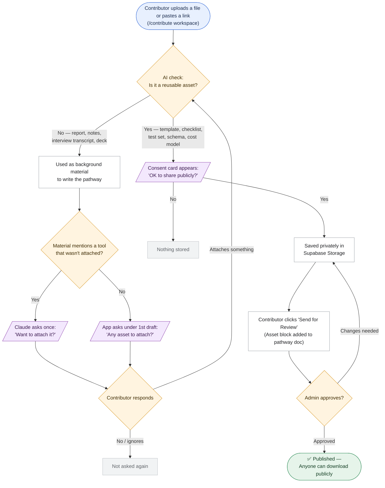
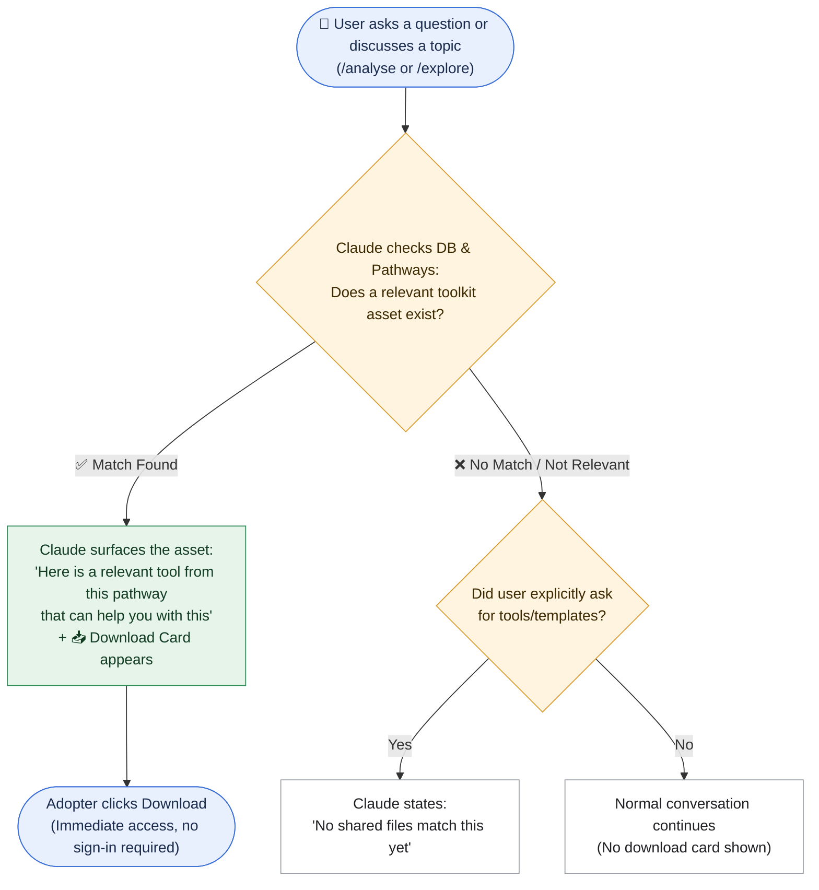
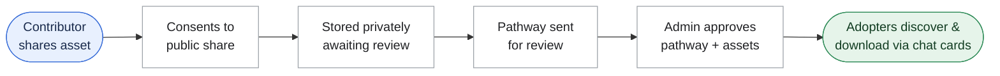

# Requirement: Store Toolkit Asset Files and Surface Them in Conversation

**Source:** Product Charter backlog item "Store toolkit-asset files, surface them in conversation" (Functional, status *In Progress* per the charter; see `docs/wiki/diffusion-cube/business/business-overview.md` → Roadmap). Requested by Anurag Goutam, 2026-09-29; scope revised 2026-09-30.

> Status: **Final scope, approved 2026-09-30. Behaviour rules added 2026-10-05** (see "How the assistant behaves" and "Flow charts"). Engineering detail and the full scenario list are in [`plan.md`](plan.md) → Appendix: Behaviour Specification; build tasks are in [`task-list.md`](task-list.md).

## The problem today

Every pathway in 100 Pathways describes "toolkit assets": ready-made things another team can reuse, such as a cost model, a checklist, an architecture note or a glossary. Today these are only **described in words** inside the pathway write-up. The real files never reach the app, so someone who wants the asset has to hunt for it themselves.

## What we are building

1. **Contributors attach the real asset.** While working on their pathway in the Contribute area, a contributor can upload the actual file (PDF, Word, PowerPoint, Excel, CSV/text, or image, up to 25 MB) or paste a link, for example a GitHub repository. ZIP files are not supported yet.
2. **The assistant spots it, and the contributor gives permission.** The assistant checks whether the upload is genuinely a reusable asset (a template, checklist or tool) rather than ordinary background material. If it is, the contributor is asked one question: *"OK to share this publicly? Anyone using 100 Pathways, including visitors who aren't signed in, will be able to download it."* If they say **No**, the file is not kept.
3. **Assets are approved together with the pathway.** When the contributor sends the pathway for review, its asset list is added to the pathway write-up. The admin reviews the assets as part of the pathway, with a preview of each file. When the admin approves the pathway, its assets go live with it; there is no separate approval step for assets. An asset added after the pathway was sent for review goes live the next time the pathway is reviewed and approved.
4. **The assistant offers the assets in conversation.** Assets are not shown as a fixed list on screen. The assistant brings them up when they're relevant, and a download card appears under its reply:
   - **Explore (public library):** after a bit of conversation about a pathway, or as soon as someone asks about tools, templates or how to reuse it, the assistant says something like "these are the assets associated with this pathway".
   - **Analyse:** when someone's own project matches a pathway (same sector and same kind of problem), the assistant suggests that pathway's assets.
5. **Anyone can download.** Approved assets can be viewed and downloaded by anyone, with no sign-in needed.

## How the assistant behaves (added 2026-10-05)

### Contributor side

**Not every upload is a toolkit asset.** Most of what a contributor shares is background material that describes the deployment. Only something another team could pick up and use as-is counts as an asset. Being a PDF, being long, or being well written doesn't make a file an asset.

| Counts as a toolkit asset | Doesn't count (background material) |
|---|---|
| Checklists, templates, cost models, test sets, data schemas, glossaries | Interview transcripts, reports, case studies, meeting notes |
| A training deck another team could run as-is | A deck that describes the deployment (pitch, results, updates) |
| The contributor's own tool or code repository | A document explaining a design decision |
| An open-source tool or platform the deployment actually built on | A tool only mentioned in passing, or evaluated and not used |

Other rules:
- Files the assistant can't read (old Word or PowerPoint formats, scanned PDFs) are judged from the file name and what the contributor says. The assistant asks at most one short question, and only if nothing says what the file is.
- Links must be https and exactly as the contributor typed them. The assistant never builds or "corrects" a link.
- If the contributor insists on something that is background material, the assistant says so plainly and neutrally, without judging its quality.
- The assistant never comments on whether a file is good. It never asks about sharing in its own words; the permission card does that.
- A file or link is only ever asked about once.

**The contributor is asked for assets.** Many contributors won't think to attach the actual files, so:
- Under the first draft of the pathway, if nothing has been offered for sharing yet, the app asks once: *"Is there any asset you want to attach with this pathway? You can attach the file or paste an https link here."*
- If the material mentions a specific item that wasn't attached (for example, "we built a vendor evaluation checklist"), the assistant asks about that item once, by name.
- If the contributor says no, or ignores it, they're never asked again in that conversation.
- Asking is never a condition for publishing, and the assistant never says sharing would make the pathway "better" or "more complete".

### Adopter side

**When assets come up.**
- Never in the assistant's first reply, unless the person's very first message asks for tools, templates, files or downloads.
- From the second message onward, once the conversation is about a relevant pathway that has assets.
- Straight away whenever the person asks about tools, templates, resources, files, downloads, or how to implement or reuse something.
- Each asset is offered once, unless the person asks again.

**How well an asset fits.** Each asset is judged on its own:

| Fit | When | What the assistant says |
|---|---|---|
| **Match** | Matches the person's situation, question, or pathway, and its "reuse when" condition applies | Suggests the asset and explains what it is and how it can help them in this pathway, based on its purpose and "reuse when". Framed as something they *could* reuse, never "you should use this". |
| **No match** | Doesn't fit what the user is doing or asking about | Nothing about assets. If the person asked outright for templates or tools, it says plainly: *"No shared toolkit files match this yet."* It may then point to a toolkit a pathway only describes in its text, saying there's no file to download. |

The assistant only knows an asset's name, purpose, reuse condition and when it was shared. It never describes what's inside a file. When assets come from several pathways, it says which pathway each comes from; when two assets serve the same need, it offers both and doesn't pick one.

**How evidence is handled (Analyse, and dates in Explore).** These rules apply to everything the assistant says, not just assets:
- **Evidence spread across pathways:** it brings the pieces together into one explanation, with each point credited to the pathway and contributor it came from. Any part of the question no pathway covers is named as a gap.
- **No evidence:** it says plainly that nothing documented covers this. It never invents an answer or presents general advice as documented experience.
- **Conflicting evidence:** when adopters took different approaches or got different results, it shows each one with the circumstances it happened in, and doesn't pick a winner. If the pathways don't explain the difference, it says so.
- **Old evidence:** when it cites a cost, a vendor or model choice, a policy, or a measured result, it says when that's from. If it's more than 12 months old, it adds that technology, prices or policy may have changed since. If no date is documented, it says so. Download cards show when each asset was shared.

## Flow charts

### Contributor side (Upload → Consent → Review → Publish)

### Adopter side (Relevance & Download)

### End-to-end lifecycle

## Who it's for

- **Anyone exploring or analysing:** gets concrete, reusable material in the flow of the conversation.
- **Contributors:** their reusable work actually gets reused. This is groundwork for the charter's later "Incentivize Contributors" milestone (15-Jan-27).
- **Admins / Program Team:** review assets in the same step as the pathway, with no extra queue.

## Deliberately not included in this release

- ZIP files, a licence field, and admin uploads.
- Approving or rejecting individual assets. It's all or nothing with the pathway; to drop an asset, the admin asks the contributor to revise before approving.
- Withdrawing an asset once it's live.
- A fixed on-screen list of assets. Assets appear only through the conversation.
- Assets on the built-in curated pathways (MahaVISTAAR, Blue Dots and others) until they exist as contributor pathways, and backfilling the assets already described in existing write-ups.
- Enhancements (a toolkit catalogue, "adapt this template for me", download counts and feedback, versioning) are listed as a future roadmap in `plan.md`.

## Trade-offs and risks, in plain terms

- **Assets become public.** Once a pathway is approved, its files can be downloaded by anyone on the internet. The permission question says so plainly. It should be checked against the Terms of Use before launch.
- **There are no download limits yet**, so heavy or automated downloading could raise storage bandwidth costs. Adding limits is recommended; it ties in with the security review.
- **Files aren't scanned** for viruses or personal data. The admin's review of the pathway is the only check.
- **Discovery depends on the conversation.** Someone who never chats beyond the first overview won't be offered the assets. A fixed list is a possible fallback later.
- **The behaviour rules are AI instructions, not hard guarantees.** Matching, asking about named items, and evidence handling depend on the AI following its instructions, so they need testing with real conversations before launch. The general "Is there any asset…" question and the dates are built into the app and always happen.
- **The AI account expires 28-Oct-2026.** If it isn't renewed, the "is this an asset?" check and the in-conversation suggestions stop working. Uploading, approving and downloading keep working.
